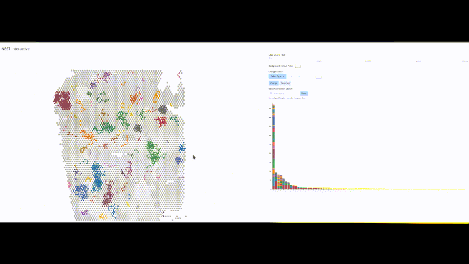
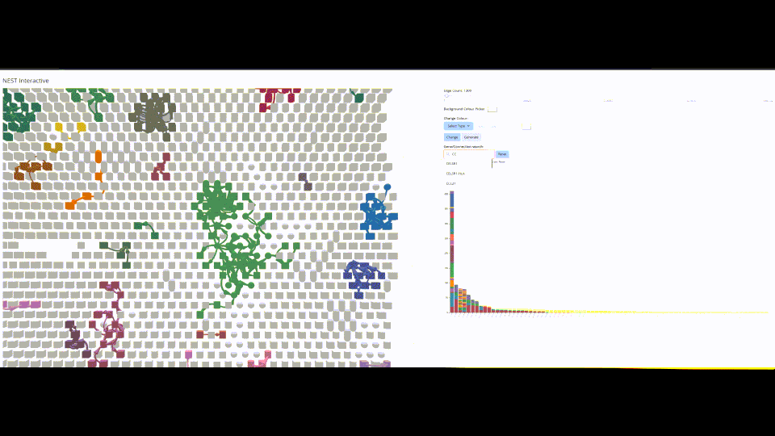
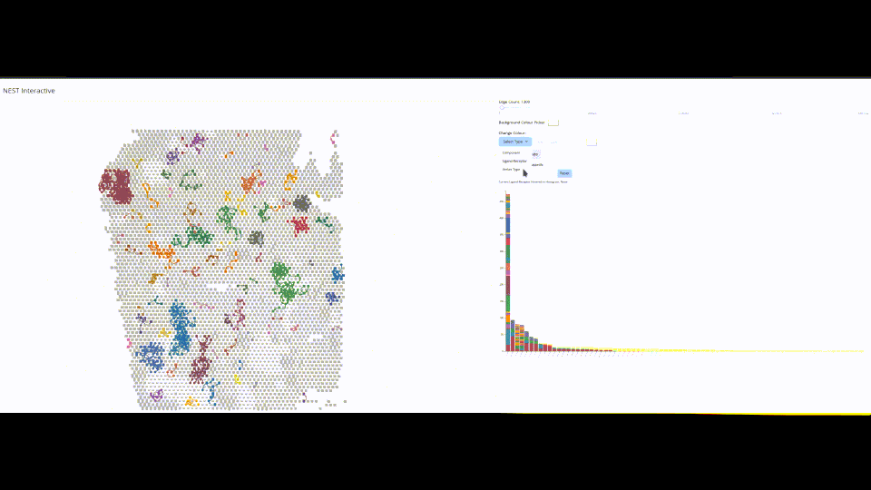
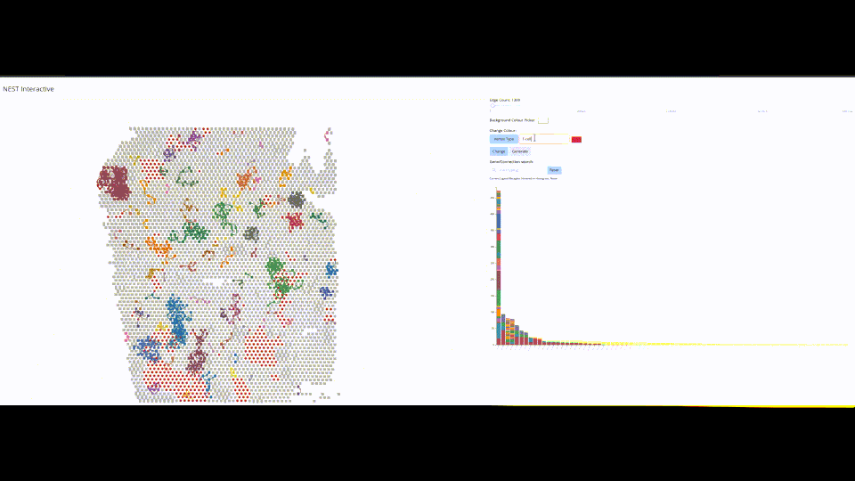
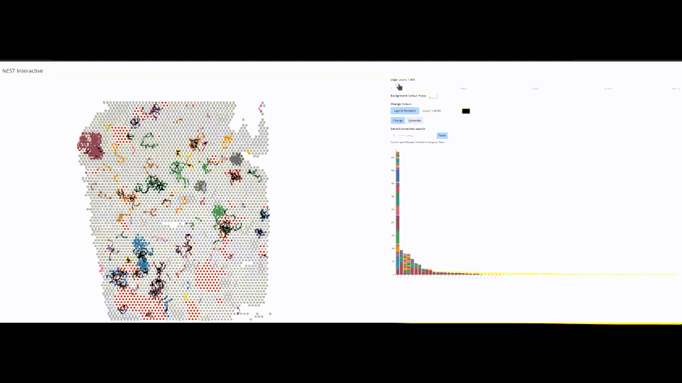

#  CellNEST 

Nature Methods: [CellNEST reveals cell–cell relay networks using attention mechanisms on spatial transcriptomics](https://www.nature.com/articles/s41592-025-02721-3)

### Singularity Image:

For users' convenience, we have a singularity image with the full installation of the environment for running the CellNEST model. Users can pull the image using the following command:
```
singularity pull cellnest_image.sif library://fatema/collection/cellnest_image.sif:latest
```
No additional installation of any package is required with this image. A vignette for following this approach is provided [here](vignette/running_CellNEST_singularity_container.md). This is tested on Digital Alliance as well. For the users who want to install the environment themselves, we provide the list of required Python packages and supported systems below.  

###   Used Python packages: 
[Python libraries](https://github.com/schwartzlab-methods/CellNEST/blob/main/requirements.txt)

###   System requirements: 
This model is developed on CentOS 7 and GPU servers with versions: Nvidia P100 and V100. This model is expected to run on any Linux server with GPU nodes, e.g., Digital Alliance (already tested) as well. A brief installation script of Python packages for Digital Alliance is provided [here](install_on_digital_alliance_readme.md). Installation time on a typical HPC should take less than 5 minutes (for 1 Intel Xeon CPU @ 2 GHz and 8 GB memory, installation takes 3 minutes). 
  
### Setup the system to recognize 'cellnest' command to run the model:

Download the CellNEST repository at your desired location and change your current working directory to CellNEST. Run the following bash script: 
````
sudo bash setup.sh
````
This is to be executed once only when CellNEST is run for the first time. This setup makes the bash script 'cellnest' executable and copies it to your '$HOME/.local/bin/' so that your system can recognize 'cellnest' command. However, if you are running the model in a remote server where you don't have permission to make such changes, you can skip this step and let the 'cellnest' command be preceded by the 'bash' command for all the instructions provided below. 


**NOTE**: 
1. We have provided a default ligand-receptor database by merging the records from CellChat and NicheNet database. This is kept under 'database/' directory and will be used by CellNEST unless some other database is referred by the user. Note that, this includes the computationally predicted ones (by NicheNet) as well. If you want to use only manually curated ligand-receptor pairs, please set: --database_path='database/CellNEST_database_no_predictedPPI.csv'. 

2. CellNEST needs raw gene count data as input. However, CellNEST pipeline does not perform any QC for cell filtering. So please run the QC pipeline beforehand if it deems necessary. But do not normalize or log tranform the gene count matrix as CellNEST has its own pipeline for doing that. However, if you only have already normalized/transformed data, and don't have access to raw counts for gene expression matrix, then you must use --skip_normalize=1 to avoid default Quantile transformation. Otherwise CellNEST may provide erroneous results.

4. If you are working with single-cell resolution data, use additional parameter --distance_measure='knn' [[here](vignette/split_graph_option.md)]. To ignore autocrine signals, you may set --block_autocrine=1.   


## Instruction to run CellNEST:

We use publicly available Visium sample on human lymph node (https://www.10xgenomics.com/datasets/human-lymph-node-1-standard-1-1-0) for most of the demonstration purpose. Please download the following two files:

a. The filtered feature matrix from here: https://cf.10xgenomics.com/samples/spatial-exp/1.1.0/V1_Human_Lymph_Node/V1_Human_Lymph_Node_filtered_feature_bc_matrix.h5

b. The spatial imaging data from here: https://cf.10xgenomics.com/samples/spatial-exp/1.1.0/V1_Human_Lymph_Node/V1_Human_Lymph_Node_spatial.tar.gz (please unzip the spatial imaging data)

Both should be kept under the same directory, e.g., data/V1_Human_Lymph_Node_spatial/ directory. Change your current working directory to the downloaded CellNEST repository. Then execute following vignettes. 
 
## Vignette

1. [Main workflow: Generate active CCC lists given a spatial transcriptomics data](vignette/workflow.md)
2. [Downstream analysis to filter CCC list for specific region / cell type / specific ligand-receptor pair](vignette/filter_ccc_list_for_type_region.md)
3. [Running the CellNEST model through singularity image](vignette/running_CellNEST_singularity_container.md)
4. [Running CellNEST with "split" option in case of very high number of cells (single-cell resolution, Visium HD, Xenium, MERFISH, etc.) or low GPU memory issue](vignette/split_graph_option.md)
5. [CellNEST on deconvoluted Spatial Transcriptomics data](vignette/deconvolute_ST.md) 
6. [CellNEST on MERFISH data after gene imputation using scRNA-seq data](vignette/integrate_scRNAseq_merfish.md)
7. [Convert ST data in any format to anndata for easy manipulation by CellNEST](vignette/convert_to_anndata.md)

   
Please use the argument --help to see all available input parameters.  


### CellNEST Interactive
Finally, you can interactively visualize the cell-cell communication on tissue surface by using CellNEST Interactive: a web-based data visualization tool. The detailed instructions for running the interactive tool are provided here: https://github.com/schwartzlab-methods/cellnest-interactive

If the platform you are using to run the CellNEST model also supports web-based data visualization, you can use the same cellnest command to start the interactive interface. We will need to pass the directory path containing the CellNEST interactive repository and the port number to start the frontend of the web-based interface. The following files (from metadata/ and output/) are also to be put in a directory and passed to the interactive interface. 

1. cell_barcode_*.csv file generated by CellNEST in the data preprocessing step (can be found from metadata/). 
2. coordinates_*.csv file generated by CellNEST in the data preprocessing step (can be found from metadata/).
3. *_self_loop_record.gz file generated by CellNEST in the data preprocessing step (can be found from metadata/).
4. Optional *_annotation.csv file, if available (can be found from metadata/).
5. CellNEST_*_top20percent.csv file generated by CellNEST in the data postprocessing step (can be found from output/).
 
For example, if the interactive repository is kept under the current working directory, port number 8080 is used, and the above-mentioned five files are kept at this path "cellnest-interactive-main/server/data/files/", then the following command should open the CellNEST interactive interface using default web-browser:
```
cellnest interactive cellnest-interactive-main/ 8080 cellnest-interactive-main/server/data/files/
```
#### Zoom and pan exploration


#### Ligand-Receptor pair filtering


#### Vertex (spot or cell) color changing


#### Communication color changing


#### Increase range of reliable signals


## [User Guide](vignette/user_guide.md)

## Dataset
1. Human Lymph Node: https://www.10xgenomics.com/datasets/human-lymph-node-1-standard-1-0-0
2. Mouse Hypothalamic Preoptic region: https://datadryad.org/stash/dataset/doi:10.5061/dryad.8t8s248}
3. Lung Cancer Adenocarcinoma (LUAD): The Gene Expression Omnibus under accession number GSE189487.
4. Pancreatic Ductal Adenocarcinoma (PDAC): The Gene Expression Omnibus accession number is to be provided before publication.


    
