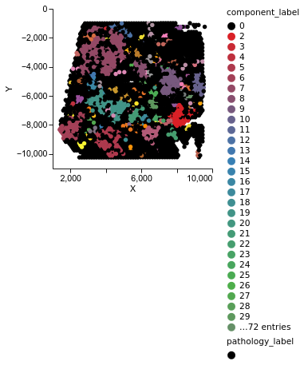
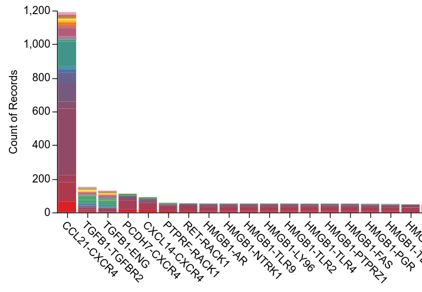
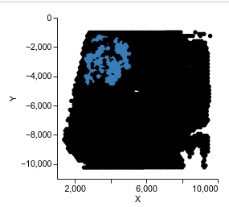
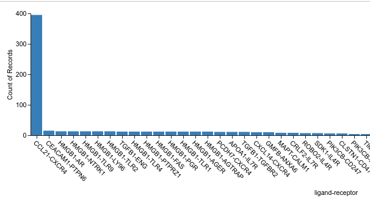
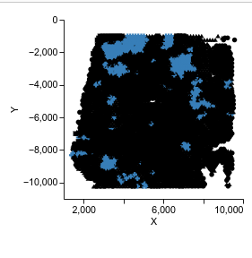
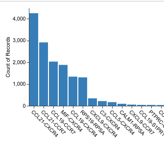
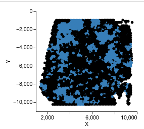

This workflow will demonstrate how to filter predicted CCC based on cell type, component/region, and ligand-receptor pair. We will start with the visualization without any particular filter and then we will show how each filter works, step by step. If we want to plot just top 3000 most strongest communication:


````
cellnest visualize --data_name='V1_Human_Lymph_Node_spatial' --model_name 'CellNEST_V1_Human_Lymph_Node_spatial' --top_edge_count=3000
````




## Filter by component/region
For those top 3000 communication, to get the list of communication only in the component 7:

````
cellnest visualize --data_name='V1_Human_Lymph_Node_spatial' --model_name 'CellNEST_V1_Human_Lymph_Node_spatial' --top_edge_count=3000 --filter=1 --filter_by_component=7
````



Usually, we want to use all the strongest communication detected by CellNEST while looking for specific cell type or ligand-receptor pair. For that purpose, we set  --top_edge_count=-1, which basically ignores this parameter for edge filtering, and plot all the interaction by target cell type or ligand-receptor pair detected by the model.

## Filter by annotation
````
cellnest visualize --data_name='V1_Human_Lymph_Node_spatial' --model_name='CellNEST_V1_Human_Lymph_Node_spatial' --top_edge_count=-1 --filter=1 --filter_by_annotation='T-cell' --annotation_file_path=data/V1_Human_Lymph_Node_spatial_annotation.csv 
````



## Filter by ligand-receptor pair


```
cellnest visualize --data_name='V1_Human_Lymph_Node_spatial' --model_name='CellNEST_V1_Human_Lymph_Node_spatial' --top_edge_count=-1 --filter=1 --filter_by_ligand_receptor='CCL19-CCR7'
```


