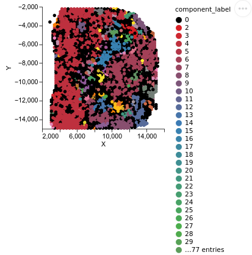
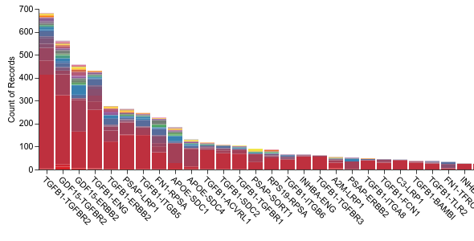

We run CellNEST with "split" option in case of very high number of cells (single-cell resolution, Visium HD, Xenium, MERFISH, etc.) 
or low GPU memory issue. We will use LUAD sample for explaining the split graph option. LUAD sample is provided in a non-Visium format. 
In such cases, it is recommended to convert the format to anndata. Let us assume we have downloaded the LUAD sample
into a directory "CellNEST/data/LUAD_GSM5702473_TD1/". It comes as a *mtx format, so following script can be run to convert it 
to anndata format (assuming that your current working directory is CellNEST):
```
python to_anndata.py --data_from=data/LUAD_GSM5702473_TD1/ --data_to_path=data/LUAD_GSM5702473_TD1/ \
--file_name=LUAD_GSM5702473_TD1 --tissue_position_file=data/LUAD_GSM5702473_TD1/GSM5702473_TD1_tissue_positions_list.csv
```
This is just a sample script and you are welcome to modify to_anndata.py according to your input format. 

After that, we will run preprocessing step with --split=1 argument which tells the model to keep additional record to allow 
model training through split option in the next step. 

```
./cellnest preprocess --data_name=LUAD_TD1_split --data_type=anndata --data_from=data/LUAD/LUAD_GSM5702473_TD1/LUAD_GSM5702473_TD1.h5ad --split=1 
```
**NOTE**: If you are using **single-cell resolution** data, please use --distance_measure='knn',  --k=50 (default) in the above preprocessing step. 
Depending on your context, you may also use these additional parameters for greater accuracy: --juxtacrine_distance, --block_autocrine, --block_juxtacrine.
(These parameters are all used in script in data_preprocess_CellNEST.py)

Then during the model training, we use --total_subgraphs argument to specify how many splits we want. 
Higher split will take less memory. In the following example we are usung --total_subgraphs=4 to indicate four splits. 
In case of single-cell resolution, this parameter can be as high as 16 or 32 since size of the dataset 
can be hundreds of thousands of cells. 

```
./cellnest run --data_name='LUAD_TD1_split' --model_name="CellNEST_LUAD_TD1_split" --num_epoch=50000 --manual_seed=yes --seed=1 --run_id=1 --total_subgraphs=4  > output_LUAD_split_r1.log &

./cellnest run --data_name='LUAD_TD1_split' --model_name="CellNEST_LUAD_TD1_split" --num_epoch=50000 --manual_seed=yes --seed=2 --run_id=2 --total_subgraphs=4  > output_LUAD_split_r2.log &

./cellnest run --data_name='LUAD_TD1_split' --model_name="CellNEST_LUAD_TD1_split" --num_epoch=50000 --manual_seed=yes --seed=3 --run_id=3 --total_subgraphs=4  > output_LUAD_split_r3.log &
 
```

Then we do the output post-processing using command "postprocess_split" and parameter --total_subgraphs=4 as follows:
```
cellnest postprocess_split --data_name='LUAD_TD1_split' --model_name="CellNEST_LUAD_TD1_split" --total_runs=3 --total_subgraphs=4
```

Then the visualization step does not need any split information since all the subgraphs are already merged into one in the previous step. 
```
./cellnest visualize --data_name='LUAD_TD1_split' --model_name="CellNEST_LUAD_TD1_split" --top_edge_count=5000
```
It generates the component plots and histograms as follows:






If you want to plot all communication, just use --top_edge_count=-1. Controlling this parameter you can visualize disjoint compartment of communication.


If you are using singularity image, then preceed the above commands with 
```
singularity run  --nv --home=<path to the directory having container image>  nest_image.sif
```

Details of each of the above steps, including various parameters and generated file locations and outputs, are provided in earlier vignettes. 
