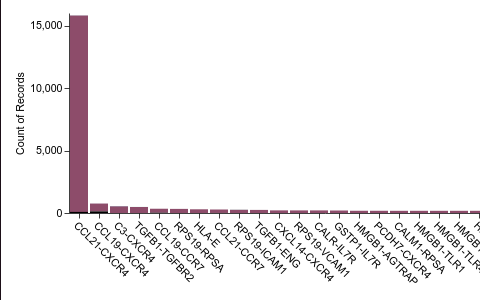
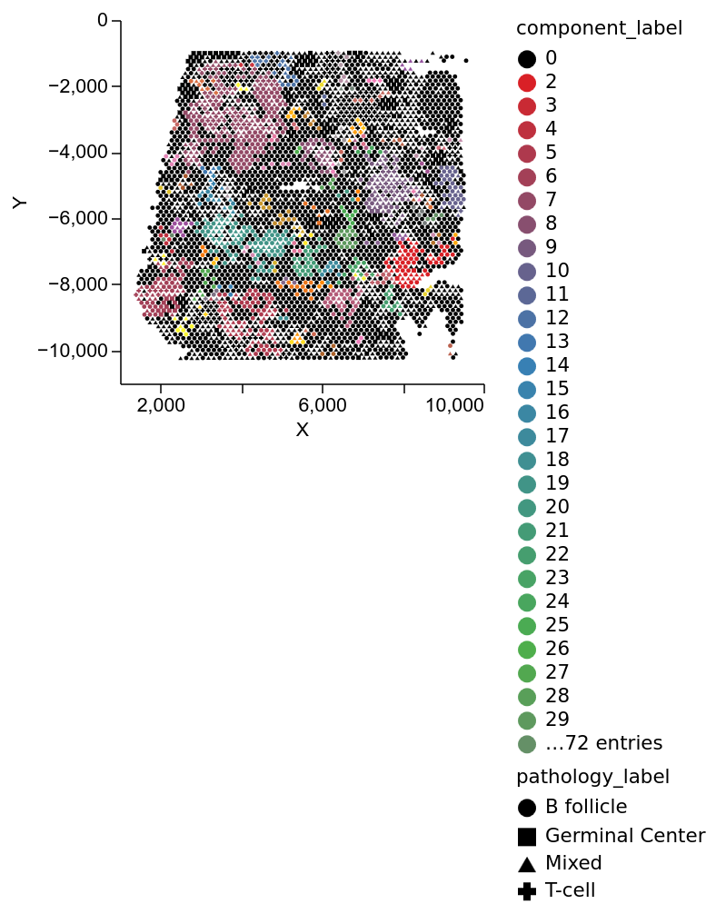
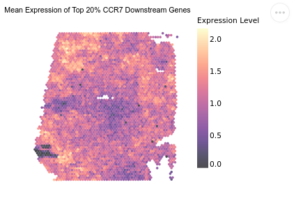
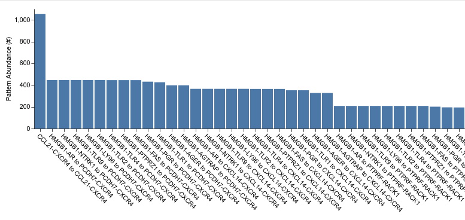
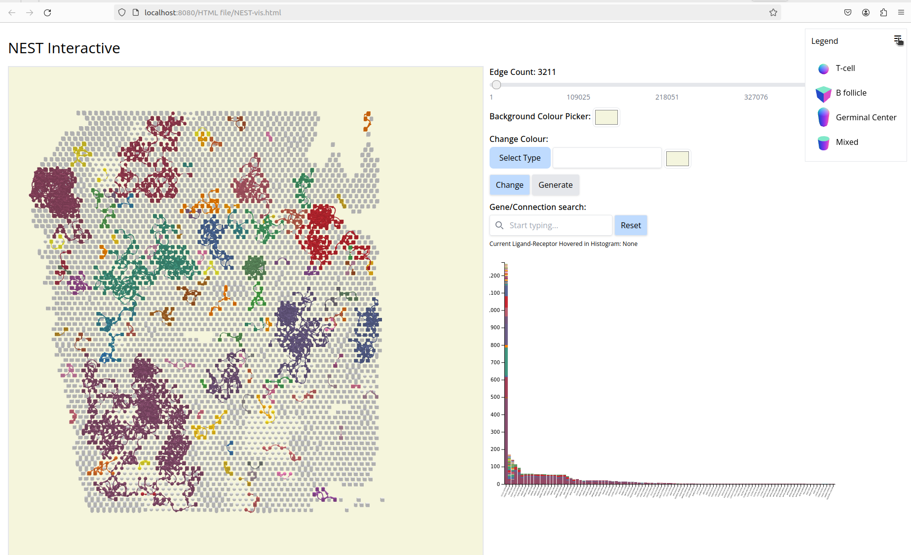

This workflow will use the Visium sample on human lymph node as a use case (https://www.10xgenomics.com/datasets/human-lymph-node-1-standard-1-1-0) for the demonstration purpose. Please download the following two files:

a. The filtered feature matrix from here: https://cf.10xgenomics.com/samples/spatial-exp/1.1.0/V1_Human_Lymph_Node/V1_Human_Lymph_Node_filtered_feature_bc_matrix.h5

b. The spatial imaging data from here: https://cf.10xgenomics.com/samples/spatial-exp/1.1.0/V1_Human_Lymph_Node/V1_Human_Lymph_Node_spatial.tar.gz (please unzip the spatial imaging data)

Both should be kept under the same directory, e.g., data/V1_Human_Lymph_Node_spatial/ directory. We have provided a default ligand-receptor database by merging the records from CellChat and NicheNet database. This is kept under 'database/' directory and will be used by CellNEST unless some other database is referred by the user.   

Change your current working directory to the downloaded CellNEST repository to run our model.

## Expected run time

For a requested 35 Intel Xeon CPUs @ 2.4 Ghz with 150 GB memory, `cellnest preprocess` takes 5 minutes and `cellnest postprocess` takes 4 minutes. `cellnest run` takes 13 hours on a requested with 32GB memory and a 28 GB NVIDIA Tesla V100 GPU.

## Data preprocessing 

We first preprocess the data before passing it to CellNEST. It takes two main inputs: spatial transcriptomics dataset and a ligand-receptor database. Assuming that the spatial dataset is in "data/V1_Human_Lymph_Node_spatial/" directory and the ligand-receptor database is in 'database/NEST_database.csv', data preprocessing for input graph generation can simply be done as follows:
````
cellnest preprocess --data_name='V1_Human_Lymph_Node_spatial' --data_from='data/V1_Human_Lymph_Node_spatial/'
````
This method applies Quantile normalization on the gene expression matrix and generates an input graph where each spot in the ST data becomes a vertex in the graph and each vertex is connected with its neighbouring vertices. The neighborhood is decided based on the --neighborhood_threshold parameter with the default value: spot_diameter*4 (--spot_diameter=89.43 is the default value), i.e., a vertex will be directly connected with all other vertices who are positioned within that distance. Each connection represents a neighbourhood relation (corresponding to a ligand-receptor pair from the database) and number of total connections in an input graph depends on two more parameters:  --threshold_gene_exp and --filter_min_cell. The default values are --threshold_gene_exp=98 (for each cell, genes having expression above 98th percentile are considered active) and --filter_min_cell=5 (gene will be kept if it is expressed in at least 5 spots). 

Lower values for --threshold_gene_exp and --filter_min_cell will generate more connections and higher values will generate less number of connections in the input graph which largly decides how much GPU memory will the model use. We try to generate as many connections as we can to predict more CCC at the end. For example, the results presented in our paper was generated using this preprocessing command:
````
cellnest preprocess --data_name='V1_Human_Lymph_Node_spatial' --data_from='data/V1_Human_Lymph_Node_spatial/' --filter_min_cell=1 
````

The --data_name parameter is used to decide the target directories to save the processed data. For example, above command creates two folders in the current working directories: 
1. "input_graph/V1_Human_Lymph_Node_spatial/": Contains
   - V1_Human_Lymph_Node_spatial_adjacency_records: The input graph
   - V1_Human_Lymph_Node_spatial_cell_vs_gene_quantile_transformed: The quantile normalized gene expression matrix
2. "metadata/V1_Human_Lymph_Node_spatial/": Contains
   - V1_Human_Lymph_Node_spatial_barcode_info: A list having the information on barcodes and their coordinates.
   - V1_Human_Lymph_Node_spatial_self_loop_record: A dictionary object saving the information on barcodes having autocrine and juxtacrine (in case of spot based data) information. Used later for efficient visualization.      
  
Please use the argument --help to see all available input parameters.  

## Run CellNEST to generate CCC list

We recommend running the model at least 5 times with different seeds and then ensemble the outputs to get more consistent result. We can run the following commands in the terminal: 
```
nohup cellnest run --data_name='V1_Human_Lymph_Node_spatial' --num_epoch 80000 --manual_seed='yes' --seed=1 --model_name='CellNEST_V1_Human_Lymph_Node_spatial' --run_id=1 > output_human_lymph_node_run1.log &
nohup cellnest run  --data_name='V1_Human_Lymph_Node_spatial' --num_epoch 80000 --manual_seed='yes' --seed=2 --model_name='CellNEST_V1_Human_Lymph_Node_spatial' --run_id=2 > output_human_lymph_node_run2.log &
nohup cellnest run  --data_name='V1_Human_Lymph_Node_spatial' --num_epoch 80000 --manual_seed='yes' --seed=3 --model_name='CellNEST_V1_Human_Lymph_Node_spatial' --run_id=3 > output_human_lymph_node_run3.log &
nohup cellnest run  --data_name='V1_Human_Lymph_Node_spatial' --num_epoch 80000 --manual_seed='yes' --seed=4 --model_name='CellNEST_V1_Human_Lymph_Node_spatial' --run_id=4 > output_human_lymph_node_run4.log &
nohup cellnest run  --data_name='V1_Human_Lymph_Node_spatial' --num_epoch 80000 --manual_seed='yes' --seed=5 --model_name='CellNEST_V1_Human_Lymph_Node_spatial' --run_id=5 > output_human_lymph_node_run5.log &
```
If you have enough GPU memory you can start running all of them in parallel. Model running takes a couple of hours to finish, so running the model in the background is recommended. 

#### Job submitting on HPC: 

If you are using remote shared GPU clusters, e.g., Compute Canada servers, then a sample script to submit the GPU job is provided here: https://github.com/schwartzlab-methods/CellNEST/blob/main/gpu_job_submit_compute_canada.sh 

## Postprocessing output to generate a list of strong CCC

To post-process the model output, i.e., ensemble of multiple runs (through the product of ranks of predicted CCCs) and produce a list of top 20% highly ranked communications, we have to run the following commands:

````
cellnest postprocess --data_name='V1_Human_Lymph_Node_spatial' --model_name='CellNEST_V1_Human_Lymph_Node_spatial' --total_runs=5 
````

  In the command, we use --total_runs=5 assuming that the model is run five times (if you run the model just once, use --total_runs=1). The top 20% highly ranked communications are saved in a file: "output/V1_Human_Lymph_Node_spatial/CellNEST_V1_Human_Lymph_Node_spatial_top20percent.csv". This step uses --top_percent=20 by default. If you would prefer different percentage, e.g., 10%, please pass the parameter --top_percent=10 while running the command.


## Visualize the list of stronger CCC in different formats

We can use the CCC list "output/V1_Human_Lymph_Node_spatial/CellNEST_V1_Human_Lymph_Node_spatial_top20percent.csv" for various downstream analysis. Here we show how to visualize those CCC on the tissue surface. Instead of plotting all the CCC (which is 436,103 and highly memory consuming) on the tissue surface, we plot top 40,000 CCC as follows:

````
cellnest visualize --data_name='V1_Human_Lymph_Node_spatial' --model_name='CellNEST_V1_Human_Lymph_Node_spatial' --top_edge_count=40000
````

This step looks for the top 20% CCC list by default, but if you used different percentage, for example, top 10% CCC list in the previous postprocessing step, then please pass the parameter --top_percent=10 while running the command. 
This step generates the following six files under the directory 'output/V1_Human_Lymph_Node_spatial/': 
1. CellNEST_V1_Human_Lymph_Node_spatial_ccc_list_top40000.csv
2. CellNEST_V1_Human_Lymph_Node_spatial_component_plot.html (in Altair) 
3. CellNEST_V1_Human_Lymph_Node_spatial_histogram_byFrequency_plot.html (in Altair)
4. CellNEST_V1_Human_Lymph_Node_spatial_histogram_byFrequency_table.csv
5. CellNEST_V1_Human_Lymph_Node_spatial_mygraph.html (in NetworkX)
6. CellNEST_V1_Human_Lymph_Node_spatial_test_interactive.dot

Although the NetworkX plot shows the appealing view of CCC, it can be very big and memory-consuming to open in the web-browser and inconvenient to share. Therefore we prefer to convert the corresponding *.dot file to a *.pdf and *.svg file by executing the following command (takes input the path of *.dot file as an argument): 

```
cellnest output_graph_picture output/V1_Human_Lymph_Node_spatial/CellNEST_V1_Human_Lymph_Node_spatial_test_interactive.dot
```
It will generate two files: edge_graph.svg and edge_graph.pdf in the current working directory, which are easy to view and share. 
 
The screenshots of the component plot and histograms are provided below (you can find the original files inside the vignette directory). 



Please note that component 1 is dedicated to only those spots that are singleton, i.e., they only have self-loops but do not communicate with neighboring spots. In the plot above, we do not see component 1 because all the spots are talking to neighbors or are inactive (black), but there is no singleton.  

### Seeing comparatively stronger CCC by changing --top_edge_count parameter from high to low

If we want to pinpoint the location of particular communications on the tissue or which regions of the tissue involve which set of communications, we can gradually reduce the value of '--top_edge_count' to see more disjoint subgraphs as follows:   

````
cellnest visualize --dataname='V1_Human_Lymph_Node_spatial' --model_name='CellNEST_V1_Human_Lymph_Node_spatial' --top_edge_count=10000
````


````
cellnest visualize --data_name='V1_Human_Lymph_Node_spatial' --model_name 'CellNEST_V1_Human_Lymph_Node_spatial' --top_edge_count=3000
````


We see that the TGFB1 signaling is more prominent in the middle region with green components. 

### Supplying annotations to use different shapes for the cell types in the altair plot

Supplying the annotation file path in a *.csv format can assign different shape to different spot types as shown below: 

````
cellnest visualize --data_name='V1_Human_Lymph_Node_spatial' --model_name='CellNEST_V1_Human_Lymph_Node_spatial' --top_edge_count=3000 --annotation_file_path='data/V1_Human_Lymph_Node_spatial_annotation.csv'
````



Next, we run the following command to convert the *.dot file to *.pdf and *.png file: 

```
cellnest output_graph_picture output/V1_Human_Lymph_Node_spatial/CellNEST_V1_Human_Lymph_Node_spatial_test_interactive.dot
```

It will generate two files: edge_graph.svg and edge_graph.pdf. The edge_graph.pdf is provided below:


## Instruction to run additional ad hoc analysis:

CellNEST also supports plotting downstream TF genes for a receptor gene, such as "CCR7" for the lymph node sample using the following command:
```
cellnest downstream --adata_path='data/V1_Human_Lymph_Node_spatial/V1_Human_Lymph_Node_filtered_feature_bc_matrix.h5' --positions_path='data/V1_Human_Lymph_Node_spatial/spatial/tissue_positions_list.csv' --gene='CCR7' 
```
This will plot the downstream average gene expression of the top 20% TF of 'CCR7' and save the result at "output/downstreamGene_CCR7.html" 




Additionally, the following three commands will output the relay patterns, cell type identification for those, and associated confidence score:

```
cellnest relay_extract --data_name='V1_Human_Lymph_Node_spatial' --metadata='metadata/' --top_ccc_file='output/V1_Human_Lymph_Node_spatial/CellNEST_V1_Human_Lymph_Node_spatial_ccc_list_top3000.csv' --output_path='output/V1_Human_Lymph_Node_spatial/'
```
It generates following files: 
1. output/V1_Human_Lymph_Node_spatial/CellNEST_V1_Human_Lymph_Node_spatial_relay_pattern_histograms.html
2. output/V1_Human_Lymph_Node_spatial/CellNEST_V1_Human_Lymph_Node_spatial_relay_pattern_count.csv
3. output/V1_Human_Lymph_Node_spatial/CellNEST_V1_Human_Lymph_Node_spatial_relay_pattern_cell_info





The following command uses the *_relay_pattern_count.csv and *_relay_pattern_cell_info generated in the previous step to identify the types of relay-generating cells.
```
cellnest relay_celltype --input_path='output/V1_Human_Lymph_Node_spatial/' --output_path='output/V1_Human_Lymph_Node_spatial/' --annotation_file='relay_validation_sample_data/lymph_node_Tcell_zone/fractional_abundances_by_spot.csv' --modality='spot'

```


The following command uses the previously generated *_relay_pattern_count.csv to find the confidence score of the corresponding relay patterns. 
```
cellnest relay_confidence --input_path='output/V1_Human_Lymph_Node_spatial/CellNEST_V1_Human_Lymph_Node_spatial_relay_pattern_count.csv' --output_path='output/V1_Human_Lymph_Node_spatial/relay_confidence_score_for_top3kCCC.csv' --organism='human' --database_dir='database/'
```


### CellNEST Interactive
Finally, you can interactively visualize the cell-cell communication on tissue surface by using CellNEST Interactive: a web-based data visualization tool. The detailed instructions for running the interactive tool are provided here: https://github.com/schwartzlab-methods/CellNEST-interactive

If the platform you are using to run the CellNEST model also supports web-based data visualization, you can use the same cellnest command to start the interactive interface. We will need to pass the directory path containing the CellNEST interactive repository and the port number to start the frontend of the web-based interface. The following files are also to be put in a directory and passed to the interactive interface. 

1. cell_barcode_*.csv file generated by CellNEST in the data preprocessing step. 
2. coordinates_*.csv file generated by CellNEST in the data preprocessing step.
3. *_self_loop_record.gz file generated by CellNEST in the data preprocessing step.
4. Optional *_annotation.csv file, if available.
5. CellNEST_*_top20percent.csv file generated by CellNEST in the data postprocessing step.
 
For example, if the interactive repository is kept under the current working directory, port number 8080 is used, and the above-mentioned five files are kept at this path "nest-interactive-main/server/data/files/", then the following command should open the CellNEST interactive interface using default web-browser:
```
cellnest interactive nest-interactive-main/ 8080 nest-interactive-main/server/data/files/
```



### Data preprocess when spatial transcriptomic data comes in non-Visium format

If data comes in a non-Visium format, we suggest to supply two files separately to the data preprocessing step: 
1. A *.mtx.gz file (having the Gene expression, Gene ID, and Barcodes)
2. Tissue position file in a *.csv format.

As an example, we request to download the Lung Adenocarcinoma (LUAD) sample from the Gene Expression Omnibus under accession number GSE189487 and keep it under the 'data/' directory: 

Then we can run the preprocess as follows:
```
cellnest preprocess --data_name='LUAD_TD1' --data_from='data/LUAD_GSM5702473_TD1/' --tissue_position_file='data/LUAD_GSM5702473_TD1/GSM5702473_TD1_tissue_positions_list.csv'
```

Similar approach can be followed for single-cell resolution, e.g., MERFISH data. 


   


