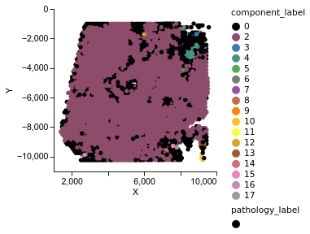

This workflow will use the Visium sample on human lymph node as a use case (https://www.10xgenomics.com/datasets/human-lymph-node-1-standard-1-1-0) for the demonstration purpose. Please download the following two files:

a. The filtered feature matrix from here: https://cf.10xgenomics.com/samples/spatial-exp/1.1.0/V1_Human_Lymph_Node/V1_Human_Lymph_Node_filtered_feature_bc_matrix.h5

b. The spatial imaging data from here: https://cf.10xgenomics.com/samples/spatial-exp/1.1.0/V1_Human_Lymph_Node/V1_Human_Lymph_Node_spatial.tar.gz (please unzip the spatial imaging data)

Both should be kept under the same directory, e.g., data/V1_Human_Lymph_Node_spatial/ directory. We have provided a default ligand-receptor database by merging the records from CellChat and NicheNet database. This is kept under 'database/' directory and will be used by NEST unless some other database is referred by the user.   

Change your current working directory to the downloaded NEST repository to run our model.

## Data preprocessing 

We first preprocess the data before passing it to NEST. It takes two main inputs: spatial transcriptomics dataset and a ligand-receptor database. Assuming that the spatial dataset is in "data/V1_Human_Lymph_Node_spatial/" directory and the ligand-receptor database is in 'database/NEST_database.csv', data preprocessing for input graph generation can simply be done as follows:
````
nest preprocess --data_name='V1_Human_Lymph_Node_spatial' --data_from='data/V1_Human_Lymph_Node_spatial/'
````
This method applies Quantile normalization on the gene expression matrix and generates an input graph where each spot in the ST data becomes a vertex in the graph and each vertext is connected with its neighbouring vertices. The neighborhood is decided based on the --neighborhood_threshold parameter and the default value is: spot_diameter*4 (--spot_diameter=89.43 is the default value), i.e., a vertex will be directly connected with all other vertices who are positioned within that distance. Each connection represents a neighbourhood relation (corresponding to a ligand-receptor pair from the database) and number of total connections in an input graph depends on two more parameters:  --threshold_gene_exp and --filter_min_cell. The default values are --threshold_gene_exp=98 (for each cell, genes having expression above 98th percentile are considered active) and --filter_min_cell=5 (gene will be kept if it is expressed in at least 5 spots). 

Lower values for --threshold_gene_exp and --filter_min_cell will generate more connections and higher values will generate less number of connections in the input graph which largly decides how much GPU memory will the model use. We try to generate as many connections as we can to predict more CCC at the end. For example, the results presented in our paper was generated using this preprocessing command:
````
nest preprocess --data_name='V1_Human_Lymph_Node_spatial' --data_from='data/V1_Human_Lymph_Node_spatial/' --filter_min_cell=1 
````

The --data_name parameter is used to decide the target directories to save the processed data. For example, above command creates two folders in the current working directories: 
1. "input_graph/V1_Human_Lymph_Node_spatial/": Contains
   - V1_Human_Lymph_Node_spatial_adjacency_records: The input graph
   - V1_Human_Lymph_Node_spatial_cell_vs_gene_quantile_transformed: The quantile normalized gene expression matrix
2. "metadata/V1_Human_Lymph_Node_spatial/": Contains
   - V1_Human_Lymph_Node_spatial_barcode_info: A list having the information on barcodes and their coordinates.
   - V1_Human_Lymph_Node_spatial_self_loop_record: A dictionary object saving the information on barcodes having autocrine and juxtacrine (in case of spot based data) information. Used later for efficient visualization.      
  
Please use the argument --help to see all available input parameters.  

## Run NEST to generate CCC list

We recommend running the model at least 5 times with different seeds and then ensemble the outputs to get more consistent result. We can run the following commands in the terminal: 
```
$ nohup nest run --data_name='V1_Human_Lymph_Node_spatial' --num_epoch 80000 --model_name 'NEST_V1_Human_Lymph_Node_spatial' --run_id=1 > output_human_lymph_node_run1.log &
$ nohup nest run  --data_name='V1_Human_Lymph_Node_spatial' --num_epoch 80000 --model_name 'NEST_V1_Human_Lymph_Node_spatial' --run_id=2 > output_human_lymph_node_run2.log &
$ nohup nest run  --data_name='V1_Human_Lymph_Node_spatial' --num_epoch 80000 --model_name 'NEST_V1_Human_Lymph_Node_spatial' --run_id=3 > output_human_lymph_node_run3.log &
$ nohup nest run  --data_name='V1_Human_Lymph_Node_spatial' --num_epoch 80000 --model_name 'NEST_V1_Human_Lymph_Node_spatial' --run_id=4 > output_human_lymph_node_run4.log &
$ nohup nest run  --data_name='V1_Human_Lymph_Node_spatial' --num_epoch 80000 --model_name 'NEST_V1_Human_Lymph_Node_spatial' --run_id=5 > output_human_lymph_node_run5.log &
```
If you have enough GPU memory you can start running all of them in parallel. Model running takes couple of hours to finish so it is recommended to run the model in background. If you are using Compute Canada servers then a sample script to submit the gpu job can look like this: 
```
to be added
```


## Postprocessing output to generate a list of stronger CCC


## Visualize the list of stronger CCC in different formats



